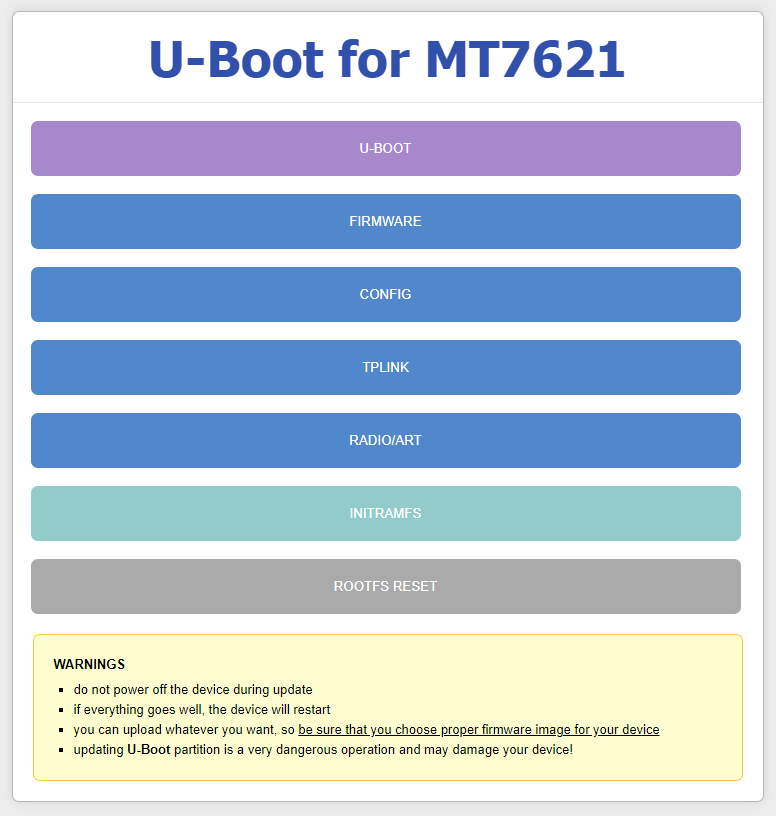

                  Ralink/MediaTek U-Boot for MT7621 MIPS SoC
                     Based on MediaTek SDK 5.0.1.0

#### Info

This is a fork of [db260179/u-boot-mt7621](https://gitlab.com/db260179/u-boot-mt7621)

- Stripped almost everything except MT7621+SPI flash boot code
- Focused mostly on supporting specific HW (TP-Link Archer AX23)
- Slightly updated toolchain and menuconfig
- Much enhanced Web Recovery functionality, additional integrity checks for uploaded data
- More WAN/LAN Port Mapping options for Multi-WAN configurations
- Code speed/size optimizations

#### Main Features

1. Press and hold the WPS button on Power-On for 2~3 sec, this will switch to Web Recovery mode. Set your Ethernet
   ipv4 to 192.168.1.2, subnet mask 255.255.255.0 and gateway 192.168.1.1.

2. Go to 192.168.1.1 from any browser and update specific partition you want.

3. Press and hold the WPS button on Power-On for 5~6 seconds to perform factory reset for OpenWrt-based firmwares



NOTE:
- U-Boot will perform switch to Web Recovery mode on flash content integrity fail.
- Alert LED(s) is blinking in Recovery mode and on erasing/flashing.

#### Quick Start (GitHub-specific)

- fork this repo
- go to 'Build Custom U-Boot' action
- select desired options (boot delay, lan/wan port mapping etc.)
- run action and download artifacts

#### Preparing Toolchain

- extract 'toolchain/mips-2021.02.tar.xz' to ~/ (tar -xvf toolchain/mips-2021.02.tar.xz -C ~/)

#### Build Instructions

- Copy appropriate '.config' file (e.g. profiles/TP-LINK/ARCHER-AX23/.config)
  to 'uboot-5.x.x.x' dir.
- Goto 'uboot-5.x.x.x' dir.
- Run 'make menuconfig', choose [Exit] and confirm [Save]. This is important step!
- Run 'make'.
- Use image file 'uboot.bin'.

To clean U-Boot tree:
- Run 'make distclean'.

#### Build for new Boards

- Goto 'uboot-5.x.x.x' dir.
- Run 'make menuconfig'.
- Select SoC, Ram, Flash type for your board. See some .config from profiles, you will get the general idea.
- Choose [Exit] and confirm [Save] then run 'make'.

NOTE:
1. Before building for a new board, know the GPIO number for reset, leds and configure them
   properly during 'make menuconfig'. Extra careful with the reset button (GPIO_BTN_RESET).
2. It's better to configure UART baud rate same as your stock firmware 115200 or 57600.
3. All profiles has disabled option "Enable all Ethernet PHY" to prevent LAN-WAN
   spoofing (EPHY will be enabled later in FW logic). To force enable EPHY (e.g. for
   use OpenWRT/PandoraBox), select option "Enable all Ethernet PHY".
4. See if your board's spi or nand flash chip is listed on here 'uboot-5.x.x.x/drivers/spi_flash.c' (281 line)
   or 'uboot-5.x.x.x/drivers/nand/nand_device_list.h'. Don't risk it if your flash chip is not on the list.

#### Flash Instructions

Take a backup of the current u-boot partition (`mtd0`):

  ```
  root@OpenWrt:/tmp# dd if=/dev/mtd0 of=uboot_orig.bin
  256+0 records in
  256+0 records out
  ```

Transfer the backup off the device and to a safe place:

  ```
  me@laptop:~# scp root@192.168.1.1:/tmp/uboot_orig.bin .
  uboot_orig.bin                                100%  128KB 128.0KB/s   00:00
  ```

**Beware**: This step may differ for other devices. I'm using TP-Link TL-MR3220v2 and it uses the first 64 KiB block to store compressed U-Boot image. In the second 64 KiB block they store additional information like MAC address, model number and WPS pin number. This means the old backup is bigger than the new one we're going to flash. To store the old settings we're going to modify only the compressed U-Boot image and leave the additional information intact. To do that, take a copy of the original file, and copy the new image over it without truncating the leftover bytes:

  ```
  root@OpenWrt:/tmp# cp uboot_orig.bin uboot_new.bin
  root@OpenWrt:/tmp# dd if=uboot_for_tp-link_tl-mr3220_v2.bin of=uboot_new.bin conv=notrunc
  128+0 records in
  128+0 records out
  ```

**Danger**: This is the point of no return, if you have any errors or problems, please revert the original image at any time using:

  ```
  root@OpenWrt:/tmp# mtd write uboot_orig.bin "u-boot"
  Unlocking u-boot ...

  Writing from uboot_orig.bin to u-boot ...
  ```

Now, to actually flash the new image, run:

  ```
  root@OpenWrt:/tmp# mtd write uboot_new.bin "u-boot"
  Unlocking u-boot ...

  Writing from uboot_new.bin to u-boot ...
  ```

To verify that the image was flashed correctly, you should verify it:

  ```
  root@OpenWrt:/tmp# mtd verify uboot_new.bin "u-boot"
  Verifying u-boot against uboot_new.bin ...
  a80c3a8683345a3fb311555c5d4194c5 - u-boot
  a80c3a8683345a3fb311555c5d4194c5 - uboot_new.bin
  Success
  ```

- Upload appropriate U-Boot image file to router's /tmp dir (e.g. via WinSCP or just wget it by creating a local http server).
- Check U-Boot image checksum and compare with uboot.md5:
```
md5sum /tmp/uboot.bin
```

Double check the boot partition name 'Bootloader' by 'cat /proc/mtd', usually it's on /dev/mtd0 or sometimes mtd1.
- Reboot router.

                             WARNING

- Do not remove power supply during flash U-Boot!!!
- Device may be bricked due to your incorrect actions!!!
